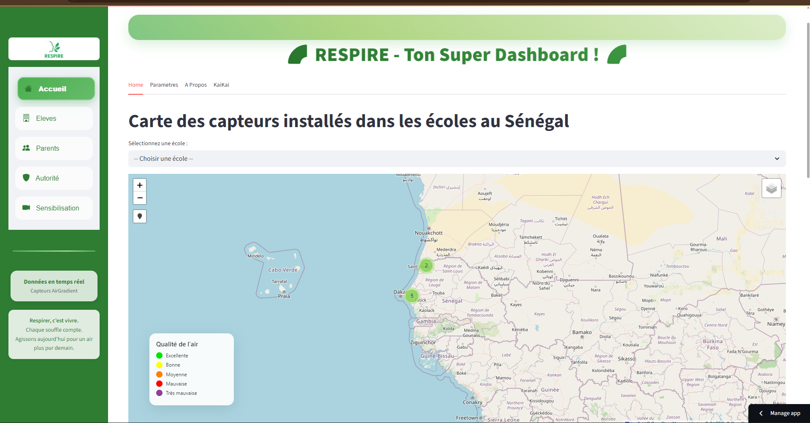
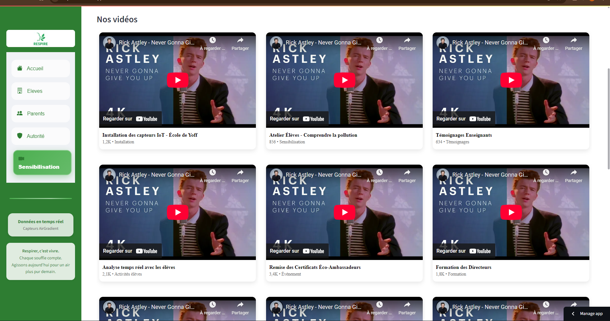

````markdown
# RESPiRE - Dashboard de Surveillance et d’Alerte Qualité de l’Air 🌍💨  

  
  
  
  

---

**RESPiRE** est une plateforme complète de **suivi, d’analyse et d’alerte sur la qualité de l’air dans les écoles**, pensée pour protéger la santé des enfants et informer les parents et responsables scolaires en temps réel.  

---

## 🚀 Fonctionnalités principales  

- **Tableau de bord interactif** : Visualisation des données (PM2.5, CO₂, température, humidité, etc.) en temps réel et sur l’historique.  
- **Calcul automatique de l’IQA** (Indice de Qualité de l’Air) journalier.  
- **Prédiction J+1** grâce à un modèle de machine learning.  
- **Alertes automatiques** (SMS / WhatsApp) aux parents en cas de dépassement de seuils critiques.  
- **Gestion des contacts parents** (import, édition, visualisation).  
- **Programmation & historique des alertes**.  
- **Configuration avancée** (seuils, horaires de silence, providers SMS/WhatsApp).  

---

## 🖼️ Aperçu visuel  

| Dashboard principal | Page de sensibilisation |
|---------------------|--------------------------|
|  |  |

---

## 📦 Installation  

1. **Cloner le dépôt**
   ```bash
   git clone https://github.com/Mr-houngbo/respire.git
   cd respire
````

2. **Créer un environnement virtuel**

   ```bash
   python -m venv env
   source env/bin/activate  # ou `env\Scripts\activate` sous Windows
   ```

3. **Installer les dépendances**

   ```bash
   pip install -r requirements.txt
   ```

4. **Configurer les secrets**

   * Renseigner vos identifiants **Twilio/Meta** dans `sms_config.json` et `whatsapp_config.json`.
   * Ajouter vos contacts dans `parents_contacts_sms.txt` et `parents_contacts.txt`.

---

## 🖥️ Lancer l’application

```bash
streamlit run app.py
```

L’interface web s’ouvre automatiquement dans votre navigateur.

---

## ⚙️ Configuration

* **Seuils d’alerte** : modifiables dans l’interface ou les fichiers de config.
* **Horaires de silence** : pour éviter les notifications la nuit.
* **Providers** : Twilio (SMS/WhatsApp Sandbox), Meta Business API (WhatsApp officiel).

---

## 📲 Envoi d’alertes

* **Automatique** : dès qu’un seuil est dépassé, les parents reçoivent une alerte personnalisée.
* **Manuel** : possibilité d’envoyer un message à la demande depuis le dashboard.
* **Historique** : visualisation des messages envoyés (date, type, parent).

---

## 🔗 Intégration & Automatisation

* **Scheduler GitHub Actions** : déclencher des alertes automatiquement à des horaires définis.

---

## 🛡️ Sécurité

* Les accès API et webhooks sont protégés par des secrets.
* Les données personnelles sont stockées **localement** et non partagées.

---

## 📁 Structure du projet

```
respire/
│
├── app.py                  # Point d’entrée Streamlit
├── src/                    # Fonctions principales (prédiction, IQA, etc.)
├── components/             # Modules UI (parents, alertes, sensibilisation)
├── models/                 # Modèles ML et scalers
├── data/                   # Données locales et historiques
├── assets/                 # Images, thumbnails, captures
├── parents_contacts_sms.txt
├── parents_contacts.txt
├── sms_config.json
├── whatsapp_config.json
├── requirements.txt
└── README.md
```

---

## 🛠️ Roadmap

* [ ] Étendre à plus d’écoles et quartiers.
* [ ] Intégrer données météo & trafic.
* [ ] Déploiement sur **Streamlit Cloud**.
* [ ] Création d’un **observatoire citoyen de l’air** en Afrique de l’Ouest.

---

## 🤝 Contribuer

Les contributions sont les bienvenues ! Merci d’ouvrir une **issue** ou une **pull request**.

---

## 👥 Équipe & Crédits

Projet développé par **l’équipe Breath4life** lors du **Hackathon KAIKAI 2025**.

📧 Contact : \[Breath4life]-[houngbocalixte@gmail.com]

---

## 📝 Licence

Ce projet est open-source sous licence **MIT**.

---

## 🌍 Internationalisation

This README is also available in [English](README.en.md).

---

**Protégeons la santé des enfants, respirons.** 💙🌱

```
